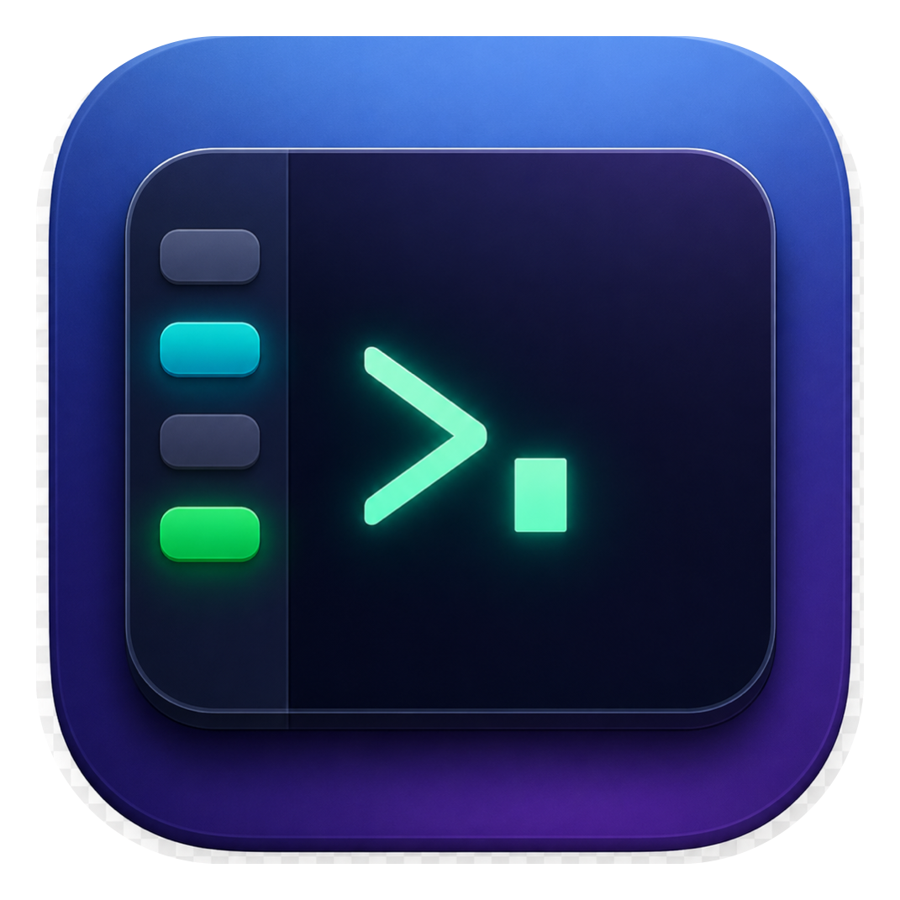

<p align="center">
  
</p>

<h1 align="center">TermHub</h1>

<p align="center">
  A native <b>macOS terminal session manager</b> — run and monitor many
  processes (dev servers, logs, ssh, builds, AI agents) from a single window.
</p>

<p align="center">
  
  
  
  
</p>

A sidebar lists terminal sessions organised into collapsible groups; the detail
area shows one or more live terminals (split view, up to 4 panes) you can work
in. Sessions keep running in the background across any layout change.

## Features

- **Groups & sessions** — full CRUD, drag-and-drop reordering, move sessions
  between groups
- **Split view** — up to 4 live terminals side by side; sessions stay alive in
  the background across any layout change
- **Status at a glance** — running / exited-0 / failed indicator, unread-output
  dot, a live-activity pulse while output streams
- **Per-session mute** — silence the unread dot and the activity pulse for noisy
  sessions (persisted)
- **Working scroll** — mouse wheel scrolls our 10k-line scrollback, with
  scroll-lock (output parks while you read history) and a scroll-position
  indicator; fullscreen TUIs (e.g. Claude Code, vim, htop) get the wheel
  forwarded so they scroll their own viewport — just like iTerm/Terminal.app.
  Keyboard scroll too (Scroll menu: ⇧PageUp/Down, ⌥⌘↑/↓, ⇧⌘↑/↓)
- **Per-session output log** — raw pty mirror on disk, recoverable even after a
  full-screen TUI (context-menu: *Open Session Log* / *Reveal Log in Finder*)
- **Broadcast input** — type one command and send it to many sessions at once
- **Profiles / templates** — capture a group or the whole workspace and relaunch
  it with one click
- **Auto-run command** per session, restart / stop, exit notifications
- **Agent control (MCP)** — let AI agents (e.g. Claude Code) manage TermHub:
  list sessions, create groups/sessions, restart/stop them, and read their
  output to diagnose failures. Off by default; per-session opt-out. See
  [Agent control](#agent-control-mcp) below
- **Start on Launch** — flagged sessions start automatically (in the
  background) when the app launches; toggle per session or per group
- **Restart schedules** — restart a session daily at a set time or every
  N hours; runs even if the session is stopped
- **Keyboard navigation** — ⌘1–9, ⌘[ / ⌘] between sessions; global ⌘⌥T show/hide
- Child shells are terminated on quit (no orphaned ptys)

## Install (build from source)

TermHub is distributed as source. Building takes a couple of minutes and needs
only the **Command Line Tools** — there is no Xcode project, and `xcodebuild`
is not used.

**Requirements:** macOS 14+ and the Command Line Tools
(`xcode-select --install` if you don't have them).

```bash
git clone https://github.com/Jerardx/TermHub.git
cd TermHub
./scripts/make-app.sh release        # builds + ad-hoc signs build/TermHub.app
cp -R build/TermHub.app /Applications/
```

That's it — apps built locally have no quarantine flag, so Gatekeeper won't
complain. (This is also why prebuilt binaries aren't published: the app is
ad-hoc signed, not notarized, so a downloaded copy would be blocked on other
Macs.)

Optional: `./scripts/make-dmg.sh` packages the app into `build/TermHub.dmg`
for your own distribution.

### Development

```bash
swift build              # compile
swift run TermHub        # run without a .app bundle
```

## Agent control (MCP)

TermHub ships with a built-in [MCP](https://modelcontextprotocol.io) server, so
an AI agent can manage your sessions — spin up a dev server in a new group,
check why a process died by reading its log, restart it, or set up a scheduled
restart — while you watch everything live in the app.

**It is off by default** — nothing listens until you enable it:

1. In TermHub open **Settings (⌘,)** and turn on **Enable Agent Control (MCP)**.
2. Register the bundled server with Claude Code — the exact command is shown in
   Settings with a **Copy** button:

   ```bash
   claude mcp add termhub -- /Applications/TermHub.app/Contents/MacOS/termhub-mcp
   ```

   (If you run the app from somewhere else, point the command at that bundle's
   `Contents/MacOS/termhub-mcp` instead.)
3. Ask your agent to e.g. *"create a group 'backend' with a session running
   `npm run dev`, and check its output if it fails"*.

Available tools:

| Tool | What it does |
| --- | --- |
| `list_sessions` | Groups + sessions with status, exit codes, commands |
| `create_group` | Add a sidebar group |
| `create_session` | Add a session (starts immediately; optional auto-start & restart schedule) |
| `restart_session` | Restart (or first-start) a session |
| `stop_session` | Stop a session's process |
| `read_output` | Tail a session's log, ANSI-stripped — for diagnosing failures |

How it works & safety:

- The app listens on a Unix socket (`~/Library/Application Support/TermHub/control.sock`,
  permissions `0600`) only while the master toggle is on; `termhub-mcp` is a
  thin stdio proxy to that socket, so everything stays local to your Mac.
- Any session can opt out via **Allow Agent Control** in its context menu (or
  per group) — agents then can't restart, stop, or read it. Sessions created
  by an agent are always agent-controllable.
- Sessions are addressed by title, `group/title`, or id.

## Tech stack

- **Swift + SwiftUI** (app shell, sidebar, sheets)
- **[SwiftTerm](https://github.com/migueldeicaza/SwiftTerm)** for the terminal
  emulator / pty
- **Swift Package Manager** — no Xcode project (Command Line Tools only)

See [`CLAUDE.md`](CLAUDE.md) for architecture notes and the source layout.
